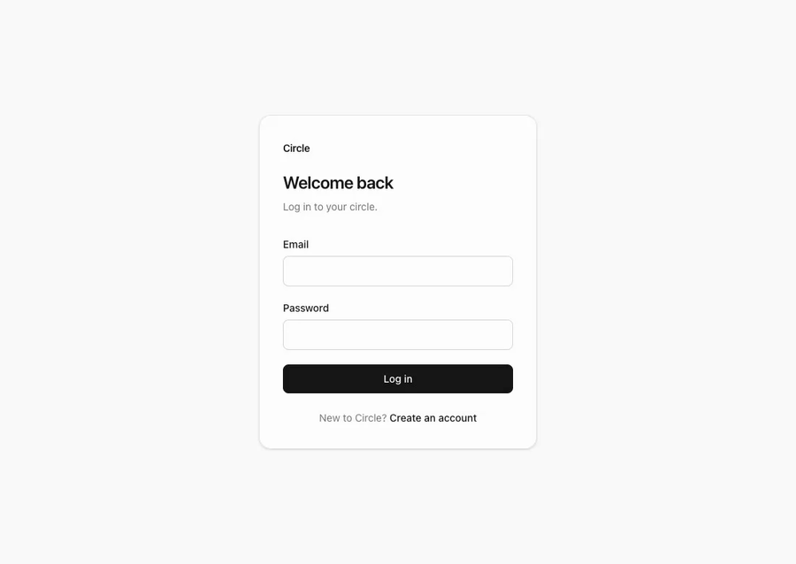

# Frontend evidence

Captured from the app's final state against a live Postgres, real sessions, real Server Actions.
Nothing here is a mockup.

## The loop



A brand-new person (Dave) opens an invite link while logged out, gets bounced to signup,
signs up, lands **inside the group**, writes a post, and sees it in the feed. One take, no cuts.

## States

| Shot | State |
|---|---|
| `01-landing` | Logged out, landing |
| `02-signup` | Signup form |
| `03-login` | Login form |
| `04-login-error` | Error — "Invalid email or password" (does not reveal whether the account exists) |
| `05-invite-dead-link` | Revoked/expired invite — does not reveal the group name |
| `06-logged-out-group-redirect` | Logged-out visitor on a group link → `/login?next=…` (UX, not security) |
| `07-home-group-list` | Signed in, group list |
| `08-feed-populated` | Feed with posts, tags, comment/reaction counts |
| `09-feed-tag-filter` | Feed filtered by `?tag=engineering` |
| `10-feed-empty-for-tag` | Empty **for this tag** — distinct copy from "no posts at all" |
| `11-compose` | New post form with tag suggestions |
| `12-settings-invites` | Invite links (absolute URL from request host), expiry, revoke, member roles |
| `13-post-detail` | Markdown body, reaction bar with own reaction highlighted, comments |
| `14-home-empty-no-groups` | Fresh account, no groups |

## Reproduce

```bash
docker compose up -d
npm run dev          # port 3002; BETTER_AUTH_URL must match
node /tmp/shots/capture.mjs
```
